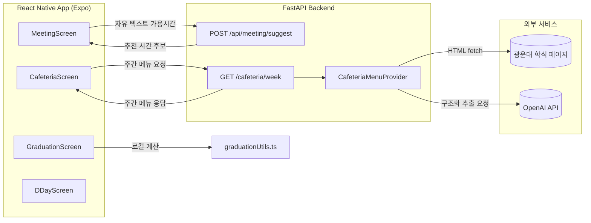

# University Life Manager (kwu-campus-helper)

광운대학교 재학생을 위한 대학생활 관리 앱입니다. React Native(Expo) 프론트엔드와 FastAPI 백엔드로 구성되어 있으며, 학식 메뉴 조회, 팀 회의 시간 자동 추천, 졸업요건 분석, 과제/시험 D-day 관리 기능을 제공합니다.

## 아키텍처



`Provider`는 `CafeteriaMenuProvider` 인터페이스이며, 환경 변수(`CAFETERIA_PROVIDER`)로 실제 구현체(`LLMExtractCafeteriaProvider` / `MockCafeteriaMenuProvider`)를 교체할 수 있습니다.

## 기능 현황

| 기능 | 화면 | 상태 |
|---|---|---|
| 학식 주간 메뉴 조회 | CafeteriaScreen | ✅ 구현 완료 |
| 팀 회의 시간 자동 추천 | MeetingScreen | ✅ 구현 완료 |
| 졸업요건 분석 | GraduationScreen | ✅ 구현 완료 (테스트 커버리지 포함) |
| D-day 날짜 계산 | DDayScreen | ✅ 구현 완료 |
| 카카오톡 알림 전송 | CafeteriaScreen | ⏳ 미구현 (아래 참고) |
| D-day 푸시 알림 / 홈 위젯 연동 | DDayScreen | ⏳ 미구현 |
| 다크 모드 테마 적용 | SettingsScreen | ⏳ 미구현 |

## 기술 스택

**Frontend**
- Expo `^54.0.31` / React Native `0.81.5` / React `19.1.0`
- TypeScript `^5.1.3`
- React Navigation (Bottom Tabs + Stack)
- React Context + useReducer (상태 관리)
- Jest + jest-expo (테스트)

**Backend**
- FastAPI `0.104.1` / Python 3.10+
- Pydantic v2
- httpx (외부 페이지 fetch), OpenAI SDK (구조화 데이터 추출)
- pytest (테스트)

**CI/CD**
- GitHub Actions: PR/push마다 프론트(tsc, jest) + 백엔드(pytest) 자동 실행
- CodeRabbit: AI 코드 리뷰 자동화

## 프로젝트 구조

```
kwu-campus-helper/
├── src/
│   ├── components/         # 재사용 컴포넌트
│   ├── screens/             # 화면 컴포넌트 (Home/Cafeteria/DDay/Meeting/Graduation/Settings)
│   ├── navigation/          # React Navigation 설정
│   ├── store/                # Context + useReducer 상태 관리
│   ├── data/                 # 졸업요건 규칙 데이터
│   ├── types/                # 타입 정의
│   ├── utils/                # 유틸 함수
│   │   └── __tests__/        # Jest 테스트
│   └── config/                # API 베이스 URL 등 설정
├── backend/
│   ├── main.py               # FastAPI 앱, 엔드포인트
│   ├── cafeteria.py          # CafeteriaMenuProvider 및 구현체
│   ├── test_main.py / test_cafeteria.py   # pytest 테스트
│   └── requirements.txt / requirements-dev.txt
├── .github/workflows/ci.yml  # GitHub Actions CI
└── App.tsx
```

## 시작하기

### 프론트엔드

```bash
npm install
npx expo start
```

- `i` : iOS 시뮬레이터 / `a` : Android 에뮬레이터 / Expo Go 앱으로 QR 스캔
- 백엔드 주소는 `src/config/api.ts`의 `API_BASE_URL`에 로컬 IP로 직접 지정해야 합니다.

### 백엔드

```bash
cd backend
python -m venv venv && source venv/bin/activate
pip install -r requirements-dev.txt
uvicorn main:app --reload
```

`backend/.env.example`을 참고해 `CAFETERIA_PROVIDER`, `OPENAI_API_KEY`를 설정하세요. 설정하지 않으면 기본값(mock provider)으로 항상 안전하게 기동됩니다.

## 테스트

```bash
# 프론트엔드
npx tsc --noEmit
npx jest

# 백엔드
cd backend && pytest -v
```

## 미구현 항목을 어떻게 구현했는가

원래 README에는 "학식 데이터 수집"과 "겹치는 시간 계산"이 TODO로 남아 있었습니다. 실제 구현 방식은 다음과 같습니다.

**겹치는 시간 계산 (MeetingScreen)** — 자유 텍스트 가용시간 입력을 정규식 기반 파서(`parseAvailabilityText`)로 구조화하고, `/api/meeting/suggest` API로 겹치는 시간대를 계산해 추천합니다. 프론트는 항상 로컬 시간(wall-clock) 문자열만 주고받도록 통일해, 타임존 변환 과정에서 생기던 서버 오류를 없앴습니다.

**학식 데이터 수집 (CafeteriaScreen)** — 정적 스크래퍼 대신, 백엔드가 학교 페이지 HTML을 직접 가져오고 OpenAI Structured Outputs로 요일별 메뉴를 구조화 추출하는 방식을 택했습니다. `CafeteriaMenuProvider` 인터페이스 뒤에 실제 구현체와 목업 구현체를 분리해뒀고, 하루 1회 캐싱과 실패 시 이전 캐시 폴백을 적용해 외부 장애가 앱 전체 장애로 번지지 않도록 했습니다.

**졸업요건 분석 (GraduationScreen)** — 로직 자체는 이미 구현돼 있었지만 테스트가 전혀 없었습니다. 학번별/세부전공별/필수 선수과목 등 조건 분기마다 현재 동작을 고정하는 회귀 테스트(Characterization Test) 32건을 추가했습니다.

## 향후 계획

- **카카오톡 알림 전송** — 카카오 알림톡은 대행사 API(예: 알리고) 계약과 발신 템플릿 사전 심사가 필요해 이번 범위에서는 보류했습니다. 예정된 설계 방향: `NotificationProvider` 인터페이스 + 알림 설정(전화번호/시간) 등록 API + 스케줄러 조합으로, 학식 데이터 수집과 동일한 패턴을 따를 예정입니다.
- **D-day 푸시 알림 / 홈 위젯 연동** — 날짜 차이 계산(`calculateDaysDiff`)은 구현되어 있으나, 실제 푸시 알림 발송과 홈 화면 위젯 연동은 아직 없습니다.
- **다크 모드 테마 적용** — 설정 화면에 토글 UI만 있고 실제 테마 전환 로직은 없습니다.

## 라이선스

Private
